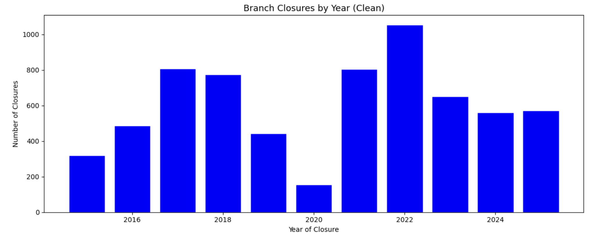
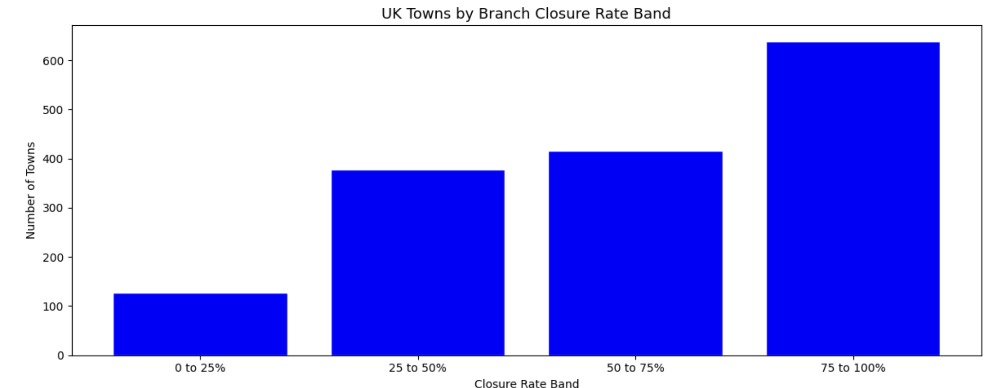
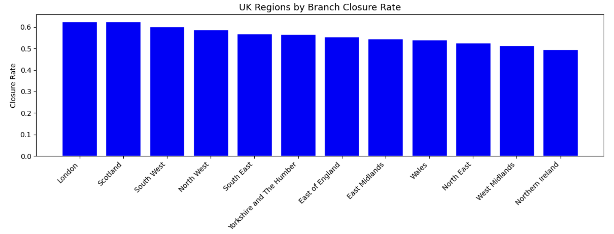
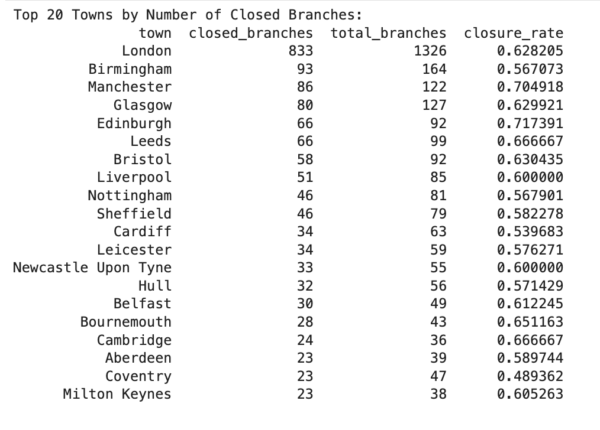

# The Decline of Physical Banking Access Across UK Communities

## Overview
This project analyses the decline of physical bank branches across the UK between 2015 and 2025, using an open dataset covering every tracked bank and building society branch in the country. 
The analysis looks at how closures have changed over time, and identifies which towns and regions have lost the largest share of their banking infrastructure.
The objective was to clean and explore a large, real-world dataset, resolve data quality issues as they appeared, and build a clear picture of where physical banking access has declined the most across the UK, covering data cleaning, exploratory analysis, and visualisations at both town and regional level.

&nbsp;

## What the Data Revealed
Branch closures have become one of the most widely discussed issues in UK retail banking, with consumer groups, regulators and MPs raising concerns about communities being left without local access to cash and in person banking services. Despite this attention, it is not always clear which parts of the country have actually been affected the most. This project was built to demonstrate the ability to take a real, publicly discussed issue and turn it into a structured analytical project, using Python to clean a messy real-world dataset,  work through data quality problems as they appeared, and produce findings that could genuinely inform a conversation about banking access in the UK.

The results point to an ongoing and accelerating decline rather than a temporary shift. Branch closures rose from around 320 in 2015 to a peak of over 1,000 in 2022, and have remained well above early levels through 2023 to 2025, with no sign of returning to where the trend started. London recorded far more closed branches than any other UK town, 833 out of 1,326 tracked, a closure rate of 63%. At a regional level, London and Scotland show the highest closure rates in the country, both around 62%, while Northern Ireland has the lowest at just under 50%. Closure count and closure rate do not always move together though, Birmingham has more closed branches in absolute terms than Manchester or Edinburgh, yet both of those cities show a noticeably higher closure rate, meaning a larger share of their overall branch network has disappeared. This is part of why the project ranks towns by closure count rather than rate, since rate alone can be misleading once branch numbers get small, but it also shows that scale and impact do not always point to the same places.

&nbsp;

## Dataset
Data was sourced from Geolytix's UK Open Bank Branches dataset containing 12,045 records across 18 columns. The dataset covers every tracked bank and building society branch across the UK, including branches that are open, permanently closed, or in the process of closing, since 2015. Fields include brand, branch type, full address, town, region, postcode, coordinates, current status, and the month and year a branch opened or closed.

The dataset presented several data quality issues that needed to be resolved before analysis, including missing values across region, branch name and address fields, and a small number of clearly incorrect closure years, including values such as 6, 7 and 20220116, which needed to be identified and removed. These issues reflected the kind of real world data quality problems typically encountered before any analysis can begin.

**Tools and Libraries:** Python, Jupyter Notebook, pandas, numpy, matplotlib

&nbsp;

## Methodology

**1) Load and Inspect the Data:** The dataset was loaded and given an initial first look to confirm its structure, size, and the type of values and gaps present, alongside a check that every column had been assigned the correct data type.

**2) Clean the Data:** Records missing a status, branch type or region were removed, since these are the three fields the whole analysis relies on. Closing branches were combined with Closed branches, and three clearly incorrect closure year values were identified and removed after they caused an unreadable chart.

**3) Explore Closures Over Time:** Branch closures were plotted by year to understand the pace of closures nationally. This revealed a rising trend from 2015 onward, a dip during 2020, and a peak in 2022.

**4) Analyse Closures at Town Level:** Branches were grouped by town to measure how many had closed in each. Towns were ranked by number of closed branches, since ranking by rate alone was found to be unreliable for towns with very few branches.

**5) Analyse Closures at Regional Level:** The same grouping and ranking approach was applied across all 12 UK regions, to test whether the pattern seen at town level held at a wider geographic level.

**6) Summarise Key Insights:** Findings from the time trend, town level and regional analysis were combined into a short summary of where and how physical banking access has declined the most across the UK.

&nbsp;

## Exploratory Data Analysis

&nbsp;

This chart shows the number of branches closed each year from 2015 to 2025. Closures started at around 320 in 2015 and climbed steadily to over 800 by 2018. There is a visible dip in 2020, before closures surge to their highest point of just over 1,000 in 2022. The rate has eased slightly since but remains well above 2015 levels through 2023 to 2025, pointing to a structural shift in how banking is delivered rather than a short term fluctuation.

&nbsp;

Towns were grouped into four bands based on the share of their branches that have closed. The largest single group of UK towns falls into the higher closure bands, meaning more communities have lost a majority of their branches than have kept most of them. This band level view shows how widespread the decline has been, rather than being isolated to a small number of extreme cases.

&nbsp;

## Outcomes

&nbsp;

Closure rate was calculated for each of the 12 UK regions to test whether the pattern found at town level held at a wider geographic scale. London and Scotland show the highest regional closure rates, both around 62%, while Northern Ireland has the lowest at just under 50%. Every region has lost a substantial share of its branches, but some have consistently been hit harder than others.

&nbsp;

Towns were ranked by the number of closed branches rather than closure rate, since rate alone becomes unreliable for towns with very few branches. London leads by a wide margin with 833 closed branches, far more than any other town in the list. The remaining top 20 is made up almost entirely of the UK's largest towns and cities, showing that the biggest absolute losses are concentrated in major urban centres, even though, as the section above shows, the highest proportional impact is not always found in the same places.

&nbsp;

## Limitations

**1) Physical Branches Only:** This project only covers physical bank branches. It does not include online banking, mobile banking apps, or telephone banking, all of which have grown quickly in recent years. 
A decline in physical branches does not necessarily mean the same decline in overall banking access, if that need is being met online instead.

**2) Closure Rate Can Be Misleading:** A town with only a few branches can reach a 100% closure rate from losing just one or two of them. This means towns are ranked by the number of closed branches rather than by closure rate.

**3) No Population Context:** Closure rate only measures the share of a town or region's own branches that have closed, it does not account for how many people live there. 
The project cannot say how many people have actually lost convenient access to a branch.

